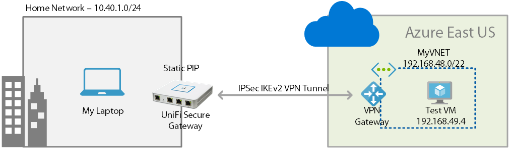
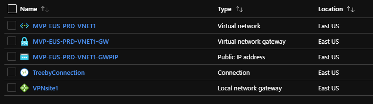
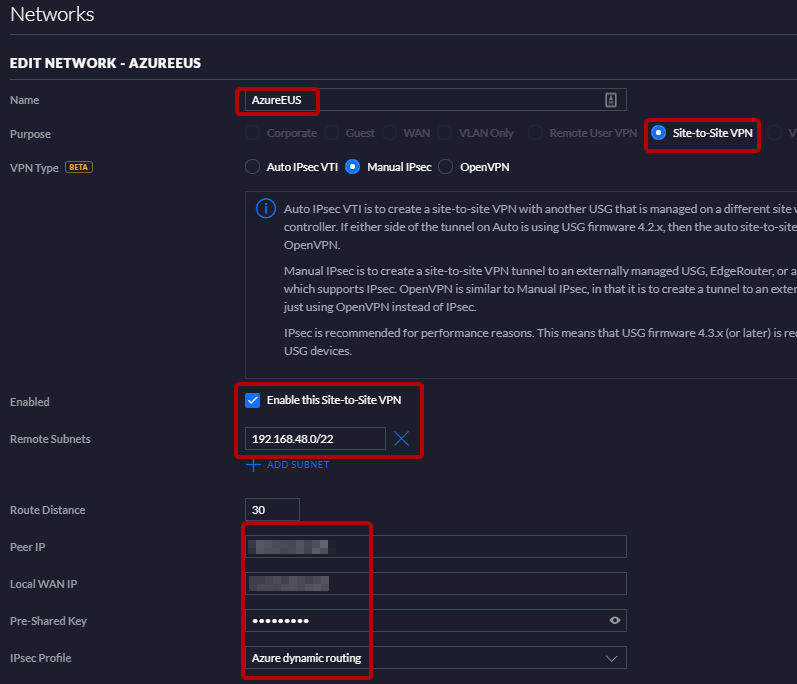
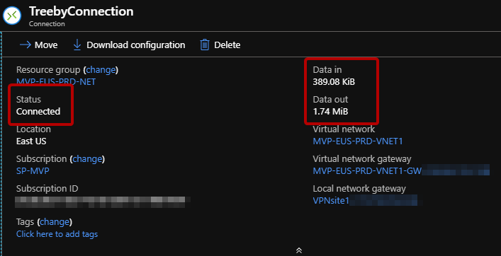

# Azure VPN with UniFi Secure Gateway

This script has the list of PowerShell commands that you can use create a hybrid lab environment. It creates a VPN tunnel with terminating with UniFi Secure Gateway. 

The script will create the following resources. 

The UniFi Secure Gateway Configuration will look like below. You will need to create a new Site to Site VPN and have the following configuration.

Once you set all setting correctly, your VPN tunnel will get established. It will look like below in the portal. 

