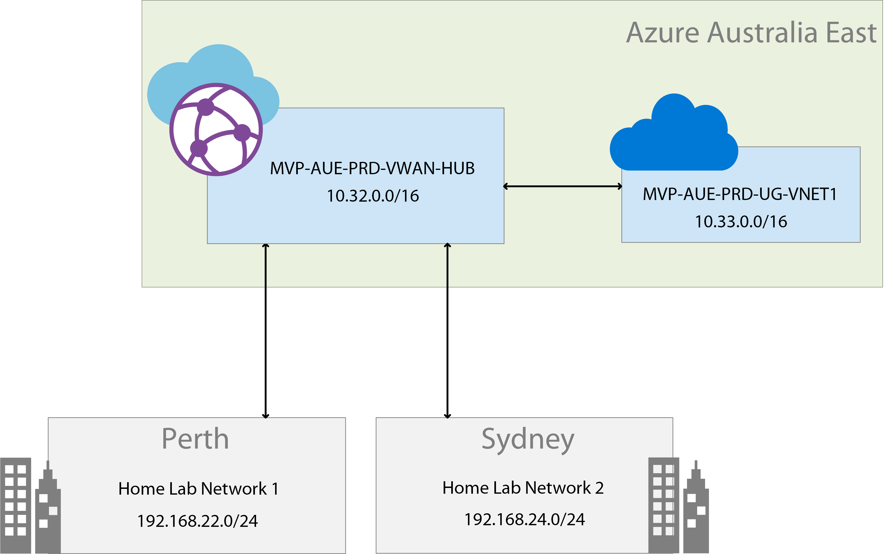

# Azure VWAN PowerShell Script

This script provisions the Azure Resources needed for the Azure VWAN Lab. It provisions Azure VWAN Resources, Virtual Networks and a Virtual Machine. 

The completed solution will like below.

The configuration is detailed in the following blog posts. 

Blog Post 1 : https://sameeraman.wordpress.com/2019/01/13/azure-vwan-part-1-lab-setup-and-provisioning/
Blog Post 2 : https://sameeraman.wordpress.com/2019/01/26/azure-vwan-part-2-zero-touch-provisioning-of-branch-sites-with-riverbed/
Blog Post 3 : https://sameeraman.wordpress.com/2019/02/08/azure-vwan-part-3-adding-riverbed-sites-to-the-azure-vwan/
Blog Post 4 : https://sameeraman.wordpress.com/2019/02/15/azure-vwan-part-4-azure-vwan-connectivity-testing/

