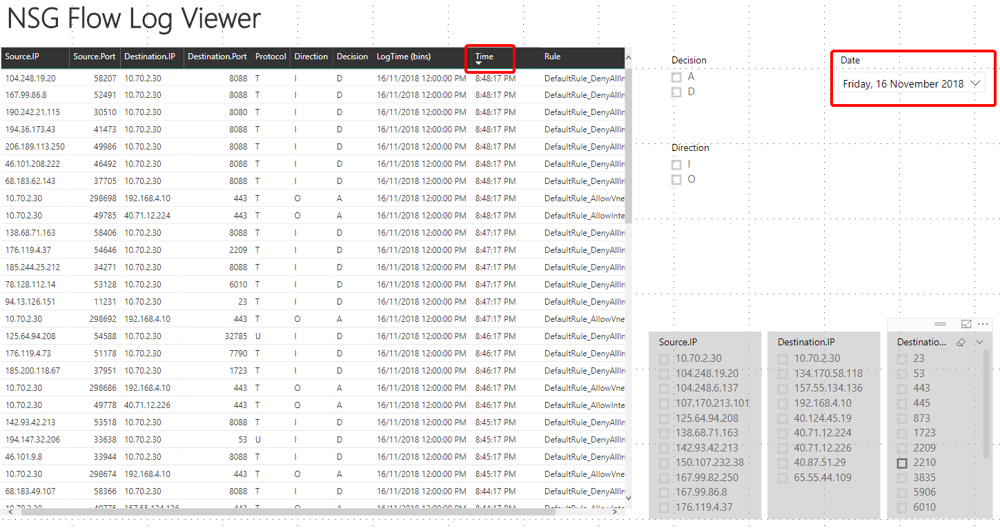

# NSG Flow Logs Troubleshooting using PowerBI

This folder provides you with a PIBX file. This file consists of a NSG flow dashboard which can help to troubleshoot NSG related issues. 

The dashboard will look as below.

For further details on how to use the dashboard please use the following references. 

Blog Post 1 : https://sameeraman.wordpress.com/2018/11/10/azure-network-troubleshooting-using-nsg-flow-logs-and-powerbi/
Blog Post 2 : https://sameeraman.wordpress.com/2018/11/15/azure-network-troubleshooting-using-nsg-flow-logs-and-powerbi-part-2/

